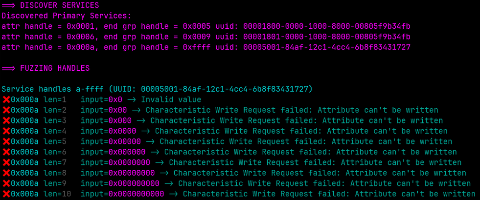
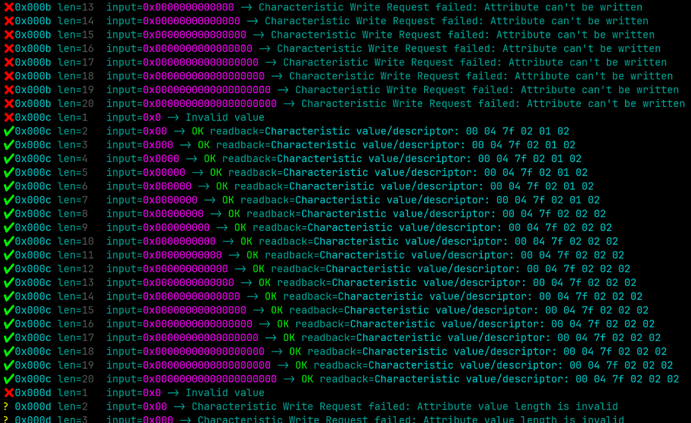

# GLIZZY — BLE GATT Handle Fuzzer


GLIZZY is a terminal-based tool for fuzzing Bluetooth Low Energy (BLE) GATT characteristic handles.  
It can probe writeable lengths, perform repeated runs, inject random or static hex payloads, and immediately read back values. Output is color-coded and concise.

---

## Intended Use

It's recommended to use GLIZZY after the running services on the target bluetooth low energy (BTLE/BLE) target device are discovered. Running in incremental mode and omitting the `-r` random flag allows the user to discover how many characters the handle (or service) will allow.





Once these are identified, then the `-r` random mode with `-n` number of fuzz runs can be enabled, to drill down on those service with the accepted input size.

---

## Installation

1. Ensure you have **Python3** and `gatttool` installed (from the BlueZ package).
2. Clone or download **`glizzy.py`** into your working directory.
3. Make sure it’s executable:
   ```bash
   chmod +x glizzy.py
   ```

---

## Usage

```bash
sudo python3 glizzy.py <MAC> [options]
```

- You **must** run as root (or with `sudo`) to use `gatttool`.

### Positional Arguments

| Name  | Description                             |
|-------|-----------------------------------------|
| `MAC` | BLE device MAC address (e.g. `AA:BB:CC:DD:EE:FF`) |

### Options

| Long Flag           | Short | Arg       | Default   | Description |
|---------------------|-------|-----------|-----------|-------------|
| `--services`        | `-s`  | hex range | —         | One or more GATT service ranges (e.g. `0x0001-0x0009`) |
| `--handles`         | `-H`  | hex range | —         | One or more handles or handle ranges |
| `--uuid`            | `-u`  | prefix    | —         | Filter services by UUID prefix |
| `--chars`           | `-c`  | int       | `10`      | Max payload length in bytes for incremental mode |
| `--runs`            | `-n`  | int       | —         | Static-length mode: run this many write attempts |
| `--addr-type`       | `-a`  | type      | `public`  | BLE address type: `public` or `random` |
| `--random`          | `-r`  | flag      | off       | Randomize payload instead of all zeroes |
| `--prefix`          | `-p`  | hex       | —         | Prefix to prepend to each payload |
| `--log`             | `-l`  | file      | —         | Log output to specified file (still prints to terminal) |
| `--read-only`       |       | flag      | off       | Only read values; no writes performed |
| `--delay`           |       | float     | `0`       | Delay (seconds) between write operations |
| `--notify`          |       | flag      | off       | Listen for notifications after writes |
| `--tui`             |       | flag      | off       | Enable interactive TUI if `curses` is available |
| `--help`            | `-h`  |           |           | Show help message |

---

## Modes of Operation

### 1. Incremental Mode (Default)
Probes each handle from length 1 up to `--chars`.

```bash
sudo python3 glizzy.py AA:BB:CC:DD:EE:FF   -s 0x000d-0x000d   -c 5
```

**Output:**
```
==> DISCOVER SERVICES
==> FUZZING HANDLES
Service handles d-d (UUID: manual)

✖ 0x000d len=1   input=0x0 -> Invalid value
? 0x000d len=2   input=0x00 -> Characteristic Write Request failed: Attribute value length is invalid
? 0x000d len=3   input=0x000 -> Characteristic Write Request failed: Attribute value length is invalid
✔ 0x000d len=4   input=0x0000 -> OK readback=Characteristic value/descriptor: 00 00
✔ 0x000d len=5   input=0x00000 -> OK readback=Characteristic value/descriptor: 00 00

==> SUMMARY
0x000d: max 5 bytes, fail at None
```

### 2. Static-Length Mode
Repeat exactly `--chars`-length writes for `--runs` iterations:

```bash
sudo python3 glizzy.py  AA:BB:CC:DD:EE:FF -s 0x000d-0x000d   -c 8   -n 5
```

- Sends five writes, each with an 8-hex-nibble payload.
- Use `-r` to randomize each payload.

You can also prepend a fixed hex pattern using --prefix:

```shell
sudo python3 glizzy.py AA:BB:CC:DD:EE:FF -H 0x000f -c 5 -n 10 -r -p 9d
```

Sends random 3-character hex strings prefixed with 9d, making each payload 0x9d??.

---

## Color Legend

- **✔** (green) – Write succeeded & read-back shown  
- **✖** (red) – Hard failure (non-zero exit, unexpected error)  
- **?** (yellow) – Soft failure (“Attribute value length is invalid”)  
- **Service handles…** (cyan) – Section headers  
- **Summary** (magenta) – Result summary  

---

## Examples

1. **Fuzz a single handle**  
   ```bash
   sudo python3 glizzy.py AA:BB:CC:DD:EE:FF -H 0x000d -c 10 -r
   ```

2. **Filter by service UUID**  
   ```bash
   sudo python3 glizzy.py AA:BB:CC:DD:EE:FF -u 00005001... -c 6
   ```

3. **Full default discovery + incremental fuzz**  
   ```bash
   sudo python3 glizzy.py AA:BB:CC:DD:EE:FF
   ```


